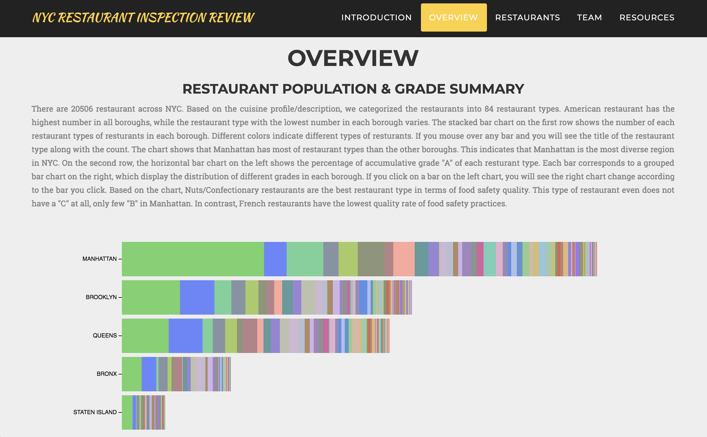
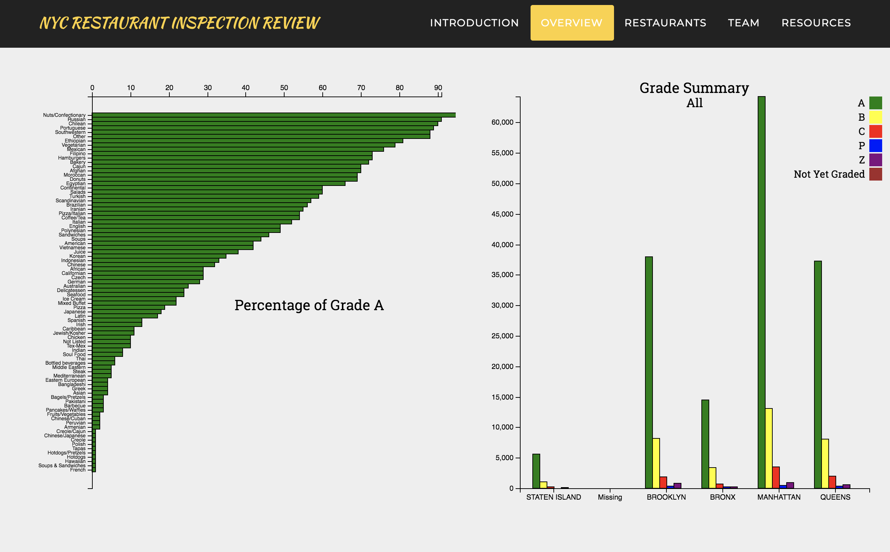
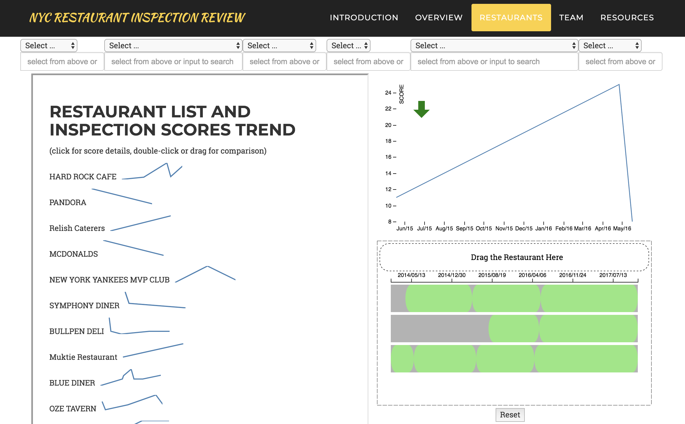

Final Project - Interactive Data Visualization  
===

Demo: [https://codescracker.github.io/NYC-Restaurant-Hygine-Visuzalition/](https://codescracker.github.io/NYC-Restaurant-Hygine-Visuzalition/)

[Video](https://youtu.be/wnpWz9-alac)

About the project
---

The goal of the projects is to provide a comprehensive and intuitive data visualization of New York City restaurant hygiene condition. 

The whole visualization contains 2 parts:
 1. The first part of the visualization focus on providing general information of restaurants hygiene condition in New York city. After exploring this part, and interact with graph, the users can get a whole picture of restaurants hygiene condition of different type of foods and districts in New York city.

 2. The second part of the visualization focus on hygiene condition history of each restaurant in New York city. The user can select the restaurant based on their demand through a series filters, view the hygiene history of selected restaurant, and compare it with other selected restaurants.

